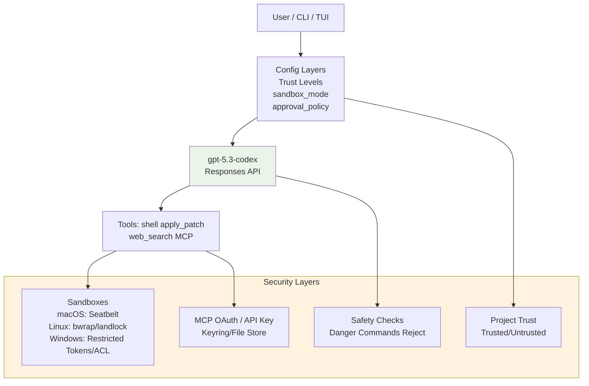

# Codex 5.3 (gpt-5.3-codex) & Security Architecture

gpt-5.3-codex: "most capable agentic coding model" - long-running, project-scale, mid-turn steering.

```mermaid
graph TB
    User[User / CLI / TUI] --> Config[Config Layers<br/>Trust Levels<br/>sandbox_mode<br/>approval_policy]
    Config --> Model[gpt-5.3-codex<br/>Responses API]
    Model --> Tools[Tools: shell apply_patch<br/>web_search MCP]
    
    subgraph Security["Security Layers"]
        Sandbox[Sandboxes<br/>macOS: Seatbelt<br/>Linux: bwrap/landlock<br/>Windows: Restricted Tokens/ACL]
        Auth[MCP OAuth / API Key<br/>Keyring/File Store]
        Trust[Project Trust<br/>Trusted/Untrusted]
        Safety[Safety Checks<br/>Danger Commands Reject]
    end
    
    Tools --> Sandbox
    Tools --> Auth
    Config --> Trust
    Model --> Safety
    
    style Model fill:#e8f5e8
    style Security fill:#fff3e0
```
