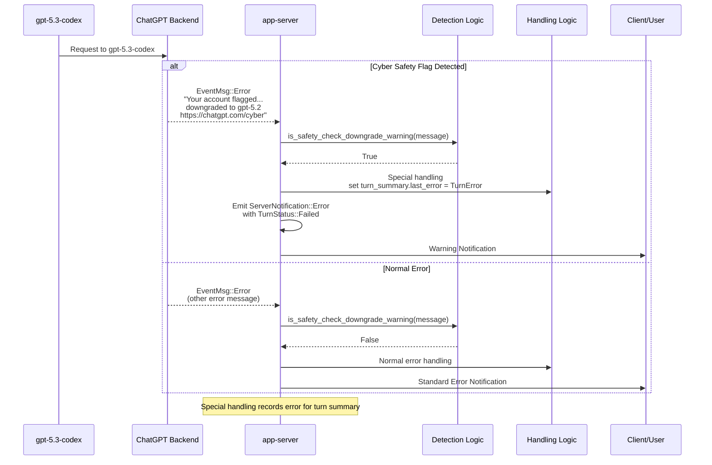

# Cyber Safety Error Flow

Detailed sequence diagram for cyber safety error handling in app-server, focusing on
ChatGPT sending EventMsg::Error with the specified message. Includes normal error flow for contrast.

From bespoke_event_handling.rs: Detection via is_safety_check_downgrade_warning checks for
flag phrase and [cyber safety link](https://chatgpt.com/cyber). If true, records TurnError in
turn_summary.last_error and emits ServerNotification::Error.

## User-Facing Error Messages

These are improved templates for cyber safety errors, designed to be clear, concise, and non-accusatory.
They explain what was blocked, why (due to safety policies), and provide actionable next steps.

### Short Template

"Your request was blocked by cyber safety checks to protect against potential risks. For help,
see [cyber safety guidelines](https://chatgpt.com/cyber) or rephrase your query."

### Detailed Template

"We're sorry, but your request was restricted due to our

What happened: [High-level description, e.g., 'The query appeared to involve sensitive
security topics.']

To proceed:

- Rephrase your request to focus on educational or defensive aspects.
- If this seems like a false positive, contact support with details."

## Recommended Remediation Steps

If your request is blocked by cyber safety checks, follow these steps to resolve or
work around the issue safely:

- **Safe Alternatives**: Reframe your query in a defensive or educational context, such as
  learning about security best practices rather than exploitation techniques. Use sanitized
  examples without real sensitive data.
- **How to Rephrase Requests**: Avoid direct references to restricted activities; instead,
  ask about general concepts or hypothetical scenarios in a positive framing (e.g., "How can
  I improve my system's security against common threats?").
- **Reporting/Escalation Path**: If you believe this is an error, contact security/admin via
  [support link] or refer to our internal policy at [policy link]. Provide context about your
  intent.
- **Guidance for False Positives**: To appeal, reply with additional context or use the
  feedback mechanism in the app. Our team reviews cases to improve accuracy.