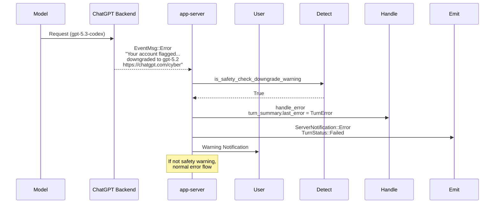

# Cyber Safety Message Handling

ChatGPT backend flags high-risk cyber activity -> downgrade to safer model (gpt-5.3-codex -> gpt-5.2) -> app-server detects warning in EventMsg::Error.

Details from bespoke_event_handling.rs:

- is_safety_check_downgrade_warning(message): Checks phrase + "https://chatgpt.com/cyber" link

- If true, special handling in handle_error (record in turn_summary.last_error)

- Emits ServerNotification::Error with TurnError

