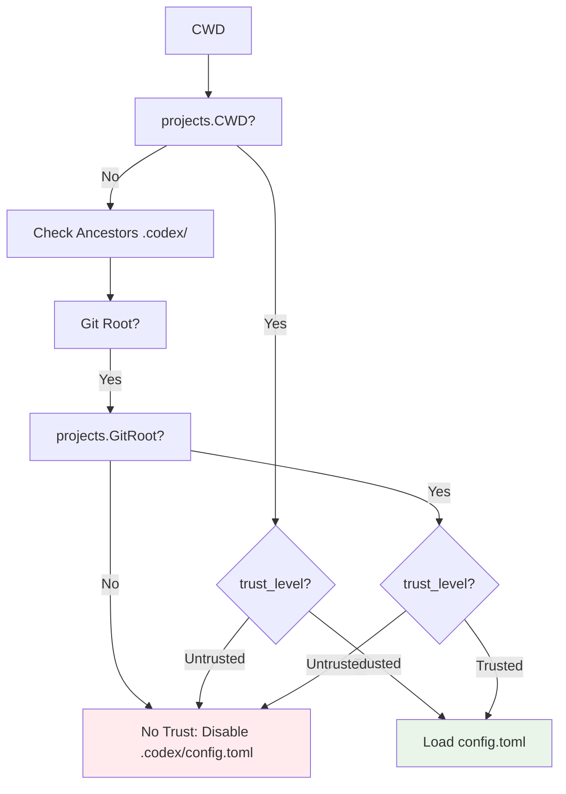

# Project Trust Levels

TrustLevel: Trusted / Untrusted in config.toml [projects."/path"] 

Controls loading of project .codex/config.toml (disabled if untrusted).

```mermaid
flowchart TD
    CWD[CWD] --> CheckCWD[projects.CWD?]
    CheckCWD -->|No| Ancestors[Check Ancestors .codex/]
    CheckCWD -->|Yes| TrustCWD{trust_level?}
    Ancestors --> GitRoot[Git Root?]
    GitRoot -->|Yes| CheckGit[projects.GitRoot?]
    CheckGit -->|No| NoTrust[No Trust: Disable .codex/config.toml]
    CheckGit -->|Yes| TrustGit{trust_level?}
    
    TrustCWD -->|Trusted| Load[Load config.toml]
    TrustCWD -->|Untrusted| NoTrust
    TrustGit -->|Trusted| Load
    TrustGit -->|Untrusted| NoTrust
    
    style Load fill:#e8f5e8
    style NoTrust fill:#ffebee
```
